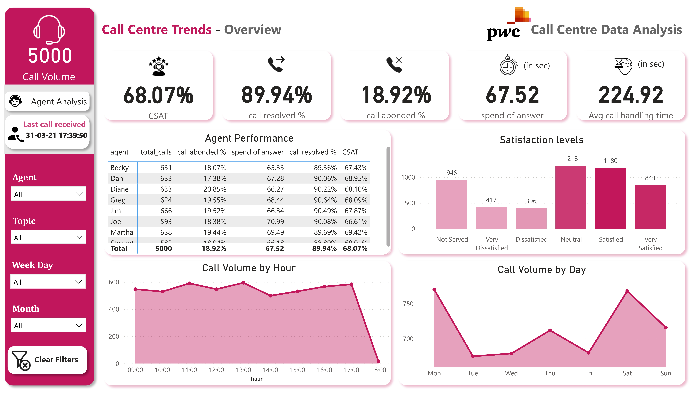

# 📞 Phone Call Center Performance & Customer Satisfaction Analysis 📊  

## 🔍 Project Overview  
In today’s customer-centric world, **call centers** play a crucial role in business success. Analyzing **call data** helps organizations optimize agent performance, improve customer satisfaction, and enhance operational efficiency.  

This project focuses on **analyzing call center performance metrics** using **Excel, SQL, and Power BI** to gain insights into:  
- **Agent efficiency & call handling**  
- **Customer Satisfaction (CSAT) levels**  
- **Call volume trends by hour & day**  
- **Call abandonment rates & resolution percentages**  

---

## 📈 Dashboards & Visualizations  

🎯 The project uses **Power BI** for dynamic and interactive visualizations.  

### 🚀 **Live Power BI Dashboard**  
🔗 **Access the dashboard here:** https://app.powerbi.com/view?r=eyJrIjoiYzBlYzQ1YzktZWYxNi00NTQzLWJkZjgtOWM3MzVmYzY2NDliIiwidCI6ImRhMDRjZDQxLTk4ZGUtNDU4YS05Zjg5LTUzNWFjODI0MWJmOSIsImMiOjJ9&pageName=df585c884c9066cbf8af

---

## 🏗️ Tech Stack  
- **📊 Power BI** - Interactive dashboards for data visualization.  
- **📜 SQL** - Data extraction, transformation, and trend analysis.  
- **📑 Excel** - Data cleaning and initial exploration.  

---

## 🎯 Key Objectives  
- ✅ **Agent Performance Analysis**: Evaluate call handling, response time, and customer satisfaction.  
- ✅ **Call Volume Trends**: Identify peak hours and busiest days.  
- ✅ **Customer Satisfaction Insights**: Assess **CSAT scores** and categorize feedback.  
- ✅ **Call Handling Efficiency**: Measure **Average Handling Time (AHT)** and response times.  
- ✅ **Service Level Metrics**: Track call abandonment rates and resolution percentages.  

---

## 📂 Dataset Overview  
This project analyzes a dataset containing **5000 customer service call records** with key details such as agent names, total calls handled, response time, resolution rates, and customer satisfaction feedback.  

### 🔑 Key Data Points  
| Feature | Description |
|---------|------------|
| `agent_name` | Call center agent handling the call |
| `total_calls` | Number of calls received by each agent |
| `call_abandoned_%` | Percentage of calls abandoned by customers |
| `call_resolved_%` | Percentage of successfully resolved calls |
| `spend_of_answer` | Average time taken to answer a call (in seconds) |
| `avg_call_handling_time` | Time spent handling each call (in seconds) |
| `CSAT_score` | Customer Satisfaction Score (out of 100%) |

---

## 📊 Key Insights  

### 📌 **Agent Performance Breakdown**  
- **Total Calls Handled:** **5000** calls.  
- **Call Resolution Rate:** **89.94%** of calls were successfully resolved.  
- **Abandonment Rate:** **18.92%** of calls were abandoned before being answered.  
- **Average Response Time:** **67.52 seconds** before an agent picks up a call.  
- **Average Handling Time (AHT):** **224.92 seconds** (~3 min 45 sec per call).  

### 📌 **Call Volume Trends**  
- **Hourly Call Trends**: Peak hours between **9 AM - 6 PM**.  
- **Daily Call Trends**: Highest call volume on **Monday - Friday**, lower activity on **weekends**.  

### 📌 **Customer Satisfaction (CSAT) Analysis**  
- **Overall CSAT Score:** **68.07%**.  
- **Breakdown of Satisfaction Levels:**  
  - **Very Satisfied:** 1,180 customers ✅  
  - **Satisfied:** 1,218 customers 😀  
  - **Neutral:** 843 customers 😐  
  - **Dissatisfied:** 417 customers 😞  
  - **Very Dissatisfied:** 396 customers 😡  
  - **Not Served:** 946 customers ❌  

---

### 📊 **Visualizations Included**  
✔️ **Agent Performance Analysis** - Compare individual agent efficiency & CSAT scores.  
✔️ **Call Volume Trends (Hourly & Daily)** - Identify peak call times.  
✔️ **Customer Satisfaction Breakdown** - Visualize CSAT distribution.  
✔️ **Call Handling Time Trends** - Track response & handling efficiency.  
✔️ **Service Level Metrics** - Evaluate resolution rates & abandonment rates.  

---

## 🚀 Advanced Analytics & Business Use Cases  

This project provides **business-driven insights** to optimize call center operations:  

- 📞 **Peak Call Time Prediction**: Helps call centers **allocate resources efficiently**.  
- 🛑 **Reducing Call Abandonment Rates**: Strategies to minimize **customer frustration**.  
- 🎯 **Improving Agent Performance**: Identify **top & low-performing agents** for training.  
- 📊 **Enhancing Customer Satisfaction (CSAT)**: Strategies to improve **CSAT scores**.  
- ⏳ **Optimizing Call Handling Time (AHT)**: Reduce **call duration** without affecting quality.  

---

## 📌 Future Enhancements
🛠 Machine Learning for CSAT Prediction: Predict customer satisfaction based on call trends.
📊 Real-time Call Volume Monitoring: Track call trends live for better workforce management.
🚀 Chatbot & AI Support Integration: Reduce call volume by implementing automated responses.
🔄 Predictive Analytics for High Call Volume Periods: Optimize staffing based on predictions.

## 🚀 Happy Coding and learning💡📊